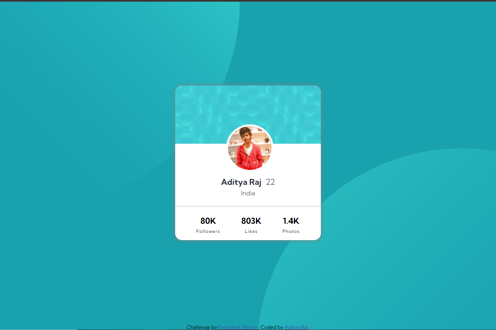

# Frontend Mentor - Profile card component solution

## Live Site URL: [Profile card component](https://adityaraj5200-profile-card-component.netlify.app/)

This is a solution to the [Profile card component challenge on Frontend Mentor](https://www.frontendmentor.io/challenges/profile-card-component-cfArpWshJ). Frontend Mentor challenges help you improve your coding skills by building realistic projects. 

## Table of contents

- [Overview](#overview)
  - [Screenshot](#screenshot)
  - [Links](#links)
- [My process](#my-process)
  - [Built with](#built-with)
- [Author](#author)

## Overview

This Site basically contains a component of your profile card in good looking UI.

### Screenshot

### Links

- Solution URL: [Solution URL](https://www.frontendmentor.io/solutions/responsive-page-using-html-css-but-with-my-picture-logo-and-my-name-MNuV7IZlj)
- Live Site URL: [Profile card component](https://adityaraj5200-profile-card-component.netlify.app/)

## My process

### Built with

- Semantic HTML5 markup
- CSS custom properties
- Flexbox

## Author

- Website - [NULL](https://www.your-site.com)
- Frontend Mentor - [@adityaraj5200](https://www.frontendmentor.io/profile/adityaraj5200)
- Twitter - [@adityaraj5200](https://www.twitter.com/adityaraj5200)
